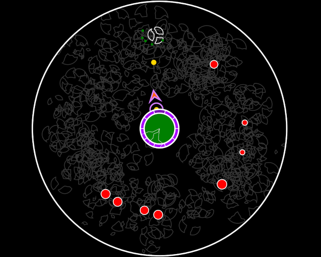

# WeaponSwitcher

This is my entry for Ludum Dare 51. The theme was "Every 10 Seconds".

[Rate here](https://ldjam.com/events/ludum-dare/51/weaponswitcher)

A shoot-em-up/defense game where your weapon switches every ten seconds. I originally planned for adding more weapons, but got dstracted by adding juice :). 

## Controls

- Mouse to aim/shoot

## Library/Engine
- None, straight HTML5 + JS only

## Tools
- [Visual Studio Code by Microsoft](https://code.visualstudio.com/)
- [Firefox Web Browser](https://www.mozilla.org/firefox/)